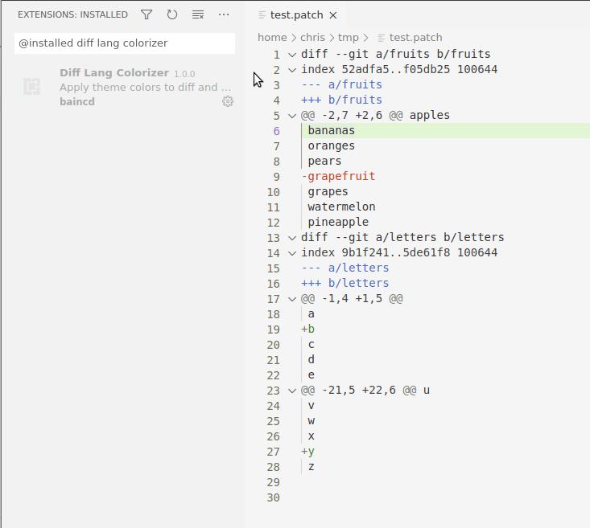

# Diff Lang Colorizer

Apply colors and styles to diff and patch files

## Features

Adds colors, styles, and weights to parts of diff and patch files.

## Configuration

The following can be configured:

- Header line text (ex: 'diff --git...'):
	- Light theme foreground color
	- Dark theme foreground color
	- Font weight (normal, bold, etc)
	- Font style (normal, italic, etc)
- Hunk range text (ex: '@@ -20,7 +20,7 @@'):
	- Light theme foreground color
	- Dark theme foreground color
	- Font weight (normal, bold, etc)
	- Font style (normal, italic, etc)
- Extended headers (lines between header line and first Hunk range)
	- Font weight (normal, bold, etc)
	- Font style (normal, italic, etc)
	- Opacity
