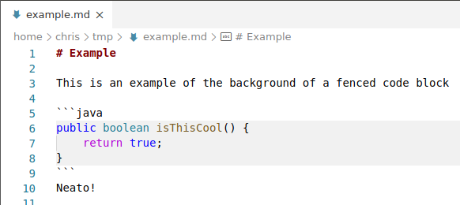
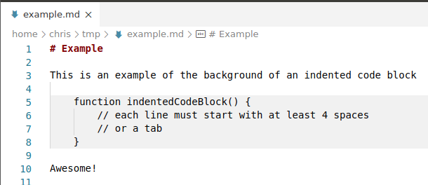

# Markdown Color Plus

Additional Colorization for Markdown Files (background color of code, invisible line breaks, and current section headers)

## Features

All these features can be configured or disabled

### Fenced Code Block Background

### Indented Code Block Background

### Inline Code Background

### Highlight invisible line breaks (2 trailing spaces)

### Highlight Current Section Headers

#### Known Limitations

* Due to limitations with the VS Code API, header highlights do not refresh when you move the cursor to whitespace or certain characters like `)`.  To update the header highlights, edit the document or move the cursor to another word.
