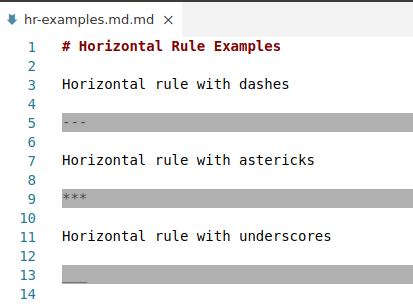

# Markdown Color Plus

Additional Colorization for Markdown Files (background color of code, invisible line breaks, strikethrough text, and current section headers)

## Features

All these features can be configured or disabled

### Fenced Code Block Background

### Indented Code Block Background

### Inline Code Background

### Horizontal Rule

### Blockquote

### Highlight invisible line breaks (2 trailing spaces)

### Strikethrough text

### Highlight Current Section Headers

## Troubleshooting

* Due to limitations with the VS Code API, header highlights do not refresh when you move the cursor to whitespace or certain characters like `)`.  To update the header highlights, edit the document or move the cursor to another word.
* Performance and other issues may be solved by modifying extension delay settings.  See extension settings for more details.
* Selected text is not visibly highlighted if the background color is 100% opaque.  To fix this, [set the alpha channel](https://www.w3schools.com/css/css3_colors.asp) so that background is partially transparent.  This can be done by defining background colors using either of these formats:
	- `#RRGGBBAA` (ex: `#0A0A0A66` → the "66" is the Alpha channel in hex.  "FF" is 100% opaque, "00" is 100% transparent, 66 is approx 40% opaque)
	- `rgba(r,g,b,a)` (ex: `rgba(10,10,10,0.40)` → 0.40 is the opacity on a scale of 0.0-1.0)

### Conflicts

The popular extension "Markdown All in One" (yzhang.markdown-all-in-one) also adds colors and decorations to markdown files, some of which overlap and could cause conflicts with this extension.

If you are not seeing the expected behavior from this extension and have "Markdown All in One" also installed, review "Markdown All in One" settings that start with `markdown.extension.theming.decoration` to see if any may be conflicting with this extension.
