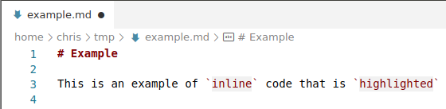
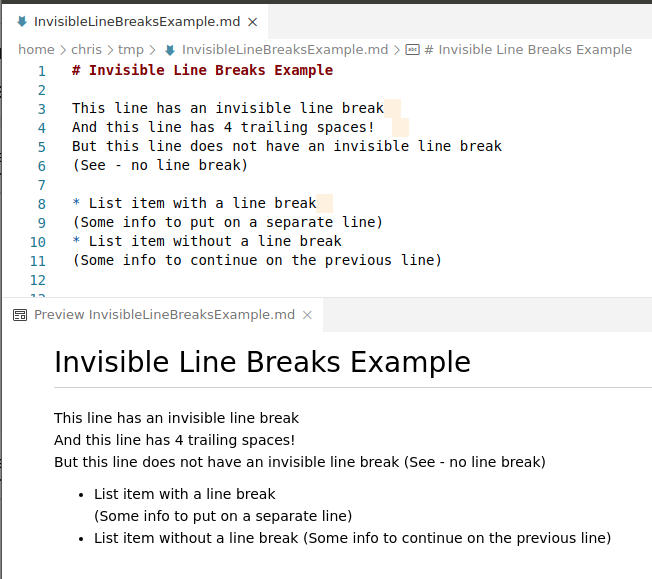

# Markdown Color Plus

Additional Colorization for Markdown Files, such as background color of code blocks, inline code, and invisible line breaks (2 trailing spaces)

## Features

All these features can be configured or disabled

### Set Background on fenced code blocks

### Set Background on indented code blocks

### Set Background on inline code

### Highlight invisible line breaks

